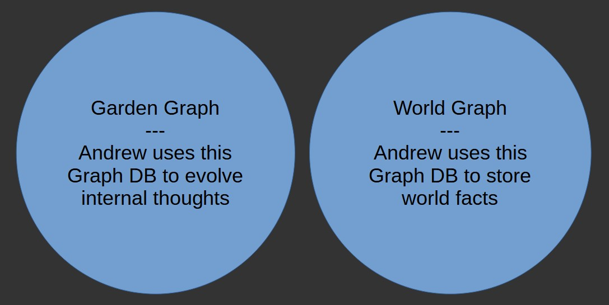

# Andrew v1.0

## Introduction

Andrew is a time-series forecasting AI application that uses a genetic algorithm on graphs of code-block-based genes to make forecasts given data contained in a graph format. These graphs are referred to as Thought Graphs.  Thought Graphs are associated with a specific target Goal.  As Andrew runs, the Thoughts are combined and mutated into new thoughts.  Andrew starts with a given set of initial Thoughts, referred to as Seed Thoughts, which can represent a process for solving a problem.  In general, Seed Thoughts model basic ideas, such as linear movement, and correlation.

Thoughts are mainly composed of Thought Operations (nodes) and Thought Sequences (edges).  The Thought Sequences are edges that pass data between Thought Operations. The Thought Operations run simple processes based on their defined operation type.  Besides the passing of data between Thought Operations, Thought Sequences also contain properties that support mutation on the passed data.  These mutation-related properties identify the range of mutations supported, and specify the amount of current mutation.  Mutations may be supported for virtually any data type, from simple mutations in Integer values to more complex mutations within sets of valid value sets; for example, changing the name of a target object or relation name used as input to a Thought Operation

<kbd>
<a href="./readme_files/thought_example.jpg" alt="example thought" target="_blank">

</kbd> 
Click here to see a full-sized image</a>

Andrew operates using two separate graph repositories.  The internal thought-related elements exist in the Garden Graph; This graph changes as Andrew runs.  The external world data on which forecasts are based is contained in a static graph called the World Graph.

<kbd>
<a href="./readme_files/two_db.jpg" alt="example thought" target="_blank">

</kbd> 
Click here to see a full-sized image</a>

## Motivations

### Under-Researched Topics

### Interactive Capable

-----

## unstructured thoughts

Besides producing outputs for consumption for downstream Thought Operations, Thought Operations may also produce side effects.  For example, having a Thought Operation that sends out e-mail should be considered a valid operation.

Andrew is designed to support horizontal scaling for both its graph data sources and its processing power.

The amount of mutation for a Thought, both the number of mutations and the magnitude of each mutation, may be dynamically adjusted for a thought based on its general fitness.  

Future: fitness functions may also be subject to evolution via genetic algorithms within defined parameters.  For example, Fitness Functions that measure stock-picking Thoughts every quarter for a year may prove to be more fit at finding profit than a once-a-year Fitness Function even after accounting for transaction fees.
[Note: Given that side effects are allowed, a research topic on the difference between predicting and causing results should be considered.]

## Current Prototype

### Seed Thought Generation

### Crossover Logic

The current crossover logic of Andrew creates crossovers using the SimpleCrossover implementation of Crossover.  This implementation produces a result that is the average of the two parent results.  This crossover approach is simple in that for each subsequent iteration a contributing ancestor's impact on the overall result on descendants is split in half.

Future Crossover implementations will be more complex.  A leading candidate for the next Crossover implementation is a crossover that merges all ancestors into a single averaging Thought Operation where the input value weights can be mutated, thus allowing individual ancestors to have a variety of weights of impact beyond what is dictated by the number of generations that have passed. 

### mutation logic

...

### Thought Operations

The current Thought Operation types supported are minimal.  In a rush to produce an initial release, some of the operations created are overly complex, and will be replaced with combinations of smaller thought operation subgraphs.  For example, the getSymbolDateRel Operation type makes assumptions as to the Node and Edge types on which it operates.  These assumptions should be removed and pushed to Thought Sequence inputs to the Operation, thus allowing more general use and situations where a mutation can be leveraged.

Like future Crossover implementations leverage an averaging operation that supports mutation

### Fitness Functions

In addition to supporting genetic operations in the genetic solutions, the fitness functions also support genetic operations within their defined ranges.  This allows fitness functions to compete.  As an example, imagine a base fitness function that looks to identify stocks that will do the best in 1-year period; it may be that a fitness function that scores quarterly will be able to identify higher annualized rates of return.  As long as the underlying scoring criterion is correct (in this case: rate of return), changing the parameters of the fitness functions might produce improved overall results. 

[Note: A program may have the ability to somewhat change its goals.]

### Graphs

#### Knowledge Graph

#### Garden Graph

### Results Report
processing generates a results report

## Next Steps

### Cyclic Thoughts

Andrew currently only supports non-cyclic Thoughts.

### GUI Thought Editor

### additional seed thoughts

### additional crossover options

### horizontally scaled test environment

## Motivations

Andrew was developed out of the desire to make something new and interesting.  Some of the initial ideas for Andrew came from an old version of a lecture from MIT OpenCourseWare 6.034 where little focus was given to Genetic Algorithms and Neural Nets due to a variety of issues.  Later, based on advancements in Neural Nets, those sections were modified to have more focus.  While Neural Nets have now hit the mainstream, Genetic Algorithms seem to have underexplored frontiers.  Andrew looks to investigate some of these frontiers.

